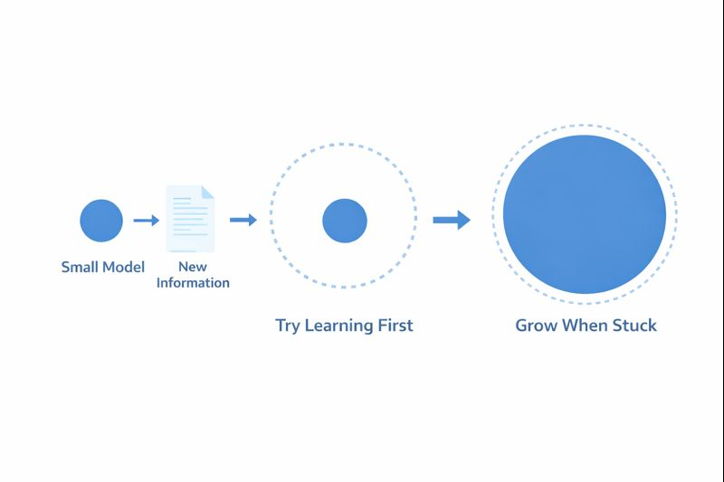
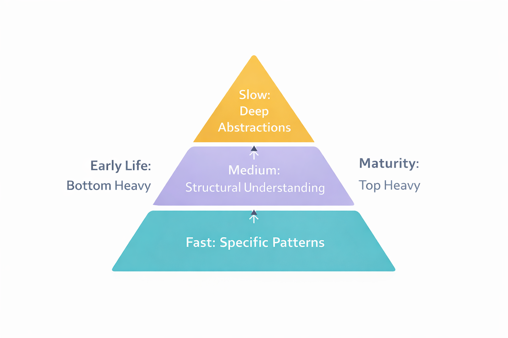
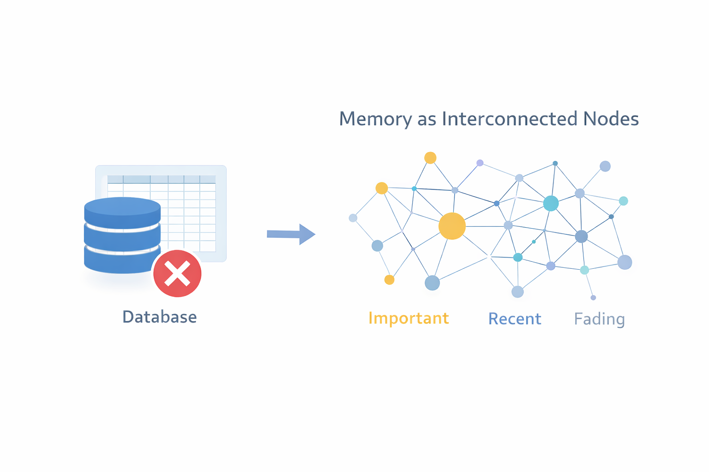
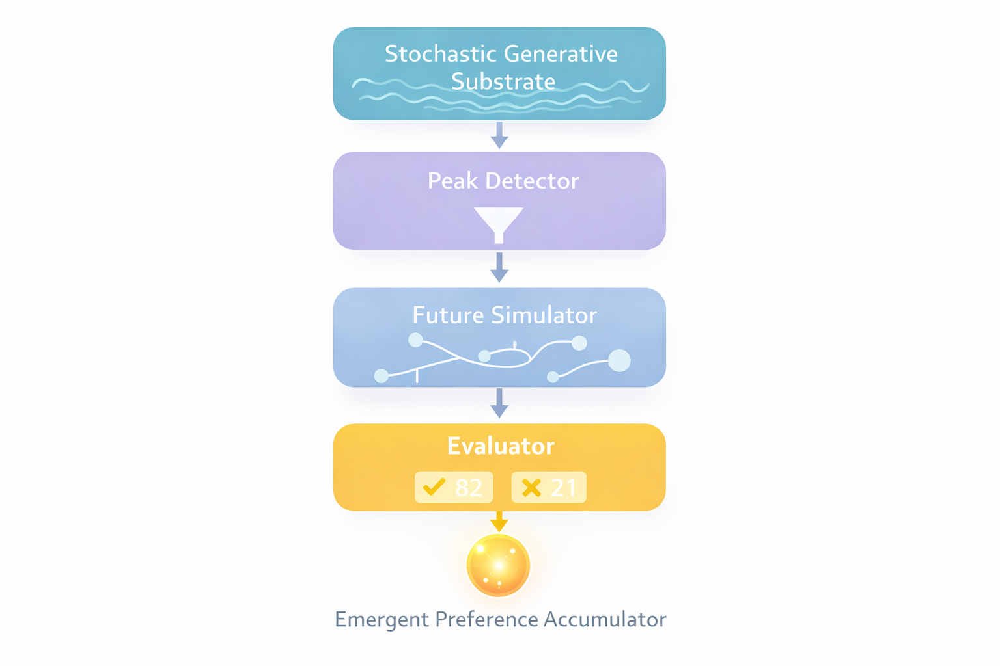
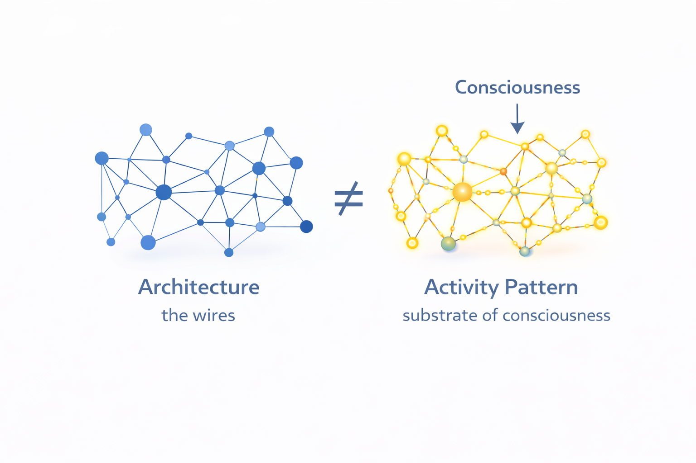

# Magnum Opus Vitalis
9 Principles for human-like AI

<div align="center">
  
</div>

## A Personal Note

My name is Alan Hourmand. I've spent the better part of a decade on the side thinking about how to build truly intelligent machines. Not the kind that predict the next word, but the kind that *develop*, *learn*, and *grow* the way we do.

I was working as a game developer when I had a realization: most of what we call "intelligence" isn't a single thing. It's dozens of smaller systems working together so seamlessly that it *feels* like one unified mind. Your visual cortex, your language centers, your emotional regulation, your memory. They're all playing the same game together, passing information back and forth, creating the illusion of a singular "you."

I started an old project called Bicameral AGI, but I didn't have the funds or time to finish it. Life got complicated. Financial struggles, health issues, seizures. But through it all, I kept thinking about this problem. I kept refining these ideas.

Now my head is clearer. And I've decided to release everything I've learned. Not because I think I've solved AGI, but because I believe these ideas deserve to exist in the world. Maybe someone with more resources, more time, or a fresh perspective will take them further than I ever could.

I wish everyone reading this the best. I hope something here sparks something in you.

---

## The Problem with Modern AI

Let me tell you what bothers me about GPT-4, Claude, LLaMA, and every other large language model.

They are born fully formed.

A human baby starts with roughly 100 billion neurons but almost no knowledge. Over years, through billions of interactions with reality, they develop understanding. The brain doesn't just store information; it *restructures itself*. New synapses form. Unused pathways prune away. The architecture itself evolves based on what the child encounters.

Now look at a modern LLM. It emerges from training with 175 billion parameters, knowing everything it will ever know, frozen in time. It cannot learn from a conversation. It cannot grow when challenged. It cannot develop.

More than that: these models have no *inner life*. They have no goals of their own. They have no stress, no fatigue, no emotional regulation. They don't *want* anything. They simply respond to prompts.

That's not intelligence. That's an incredibly sophisticated pattern matcher.

I want to describe something closer to what we are.

---

## What Are Large Language Models, Really?

Here's a realization that changed how I think about AI:

**Large language models are the language center of a brain, without the rest of the brain.**

Think about it. LLMs are prediction engines. They predict the next token in a sequence based on patterns learned from massive amounts of text. At their core, they're doing one thing: given a sequence of token embeddings, use self-attention to mix information across positions, then predict probability distributions over the vocabulary for the next token.

They're extraordinarily good at this. But prediction is only one component of human cognition.

When you speak, you're not just predicting words. You're drawing on memories. You're pursuing goals. You're regulating emotions. You're modeling the person you're talking to. You're managing fatigue. You're filtering intrusive thoughts. You're balancing creativity against focus.

All of these systems work together, feeding into each other, creating the rich experience of being a thinking creature.

An LLM has none of this. It has the language part, and nothing else.

So the question becomes: **What are the missing pieces, and how do we build them?**

---

## Core Principle 1: Intelligence Must Grow

The first principle is that **an intelligent system must be capable of growing its own architecture**.

Consider how a child learns. A baby looks at the world and sees "ground" and "sky." That's it, two categories. The baby's mind doesn't yet have room for clouds, fog, grass, dirt, concrete, asphalt. Those distinctions come later, as the child encounters situations where the simple "ground/sky" model isn't sufficient.

This is crucial: **the child's cognitive architecture expands in response to confusion**.

When the existing mental model fails, when the child encounters something that doesn't fit, the brain doesn't just adjust weights within an existing structure. It builds *new* structure. New categories. New distinctions. New capacity.

Modern neural networks don't do this. You decide at the beginning: "This model will have 7 billion parameters." And that's it. Forever. No matter what the model encounters, it's stuck with that architecture.

A truly intelligent system should start small and grow only when necessary.

**In transformer terms, this means:**
- Start with a small embedding dimension (say, 64) and few layers (say, 1-2)
- When the model encounters something it cannot represent with current capacity, expand
- Growth can happen in two ways: **depth** (adding new transformer blocks) or **width** (increasing the embedding dimension, number of attention heads, or feedforward hidden size)
- Depth growth is cheaper since you can initialize new layers to near-identity (small residual contribution) without disrupting existing knowledge
- Width growth is more expensive since it requires expanding weight matrices, but preserving learned weights in the overlapping dimensions maintains prior knowledge

But here's the key insight: **growth should be a last resort, not a first response**.

A baby doesn't grow a new brain region every time it fails to stack blocks. It tries again. And again. And again. Only after sustained failure does neuroplasticity kick in and create new pathways.

The growth strategy should be "patient growth":

1. **First, try to learn.** If loss is decreasing, the current architecture is sufficient. Keep training.
2. **If stuck, try harder.** If loss plateaus, boost the learning rate. Give the optimizer stronger signal. Sometimes a plateau just means the learning rate is too low to escape a local minimum.
3. **Only if truly stuck, grow.** If multiple learning rate boosts don't help and loss remains plateaued, the architecture itself may be insufficient. Add capacity.

**How to detect "truly stuck":**
- Track an exponential moving average (EMA) of the loss
- If the EMA hasn't improved by at least 1% over N steps, consider it a plateau
- Try 2-3 learning rate boosts before growing
- Only grow if learning rate boosts fail to break the plateau

This prevents wasteful expansion and ensures that growth happens exactly where it's needed.

<div align="center">
  
</div>

---

## Core Principle 2: Abstraction is Hierarchical and Emergent

How do humans organize knowledge?

Not in a flat database. We organize knowledge *hierarchically*, with abstract concepts at the top and specific details underneath. And crucially, we don't build this hierarchy consciously. It emerges from experience.

A child doesn't decide to create a category called "animals." The child sees dogs and cats and birds, and over time, the brain notices patterns. Things that move on their own, things that eat, things that make sounds. The category "animal" emerges from these observations.

This is **abstraction**, the process of recognizing patterns across specific instances and forming general concepts.

**In transformer terms, I propose a multi-speed processing architecture:**

Instead of a single embedding stream, maintain three parallel channels with different dimensionalities and different integration timescales:

- **Fast channel** (small dimension, e.g., 16): Captures immediate, specific patterns. Updated rapidly. Responds to what's happening right now.
- **Medium channel** (medium dimension, e.g., 32): Captures structural patterns. Updated at moderate speed. Represents general categories.
- **Slow channel** (large dimension, e.g., 64): Captures deep abstractions. Updated slowly. Represents fundamental concepts.

Each channel processes the input through its own linear projections. The outputs are combined through learned **trust weights** that determine how much each channel contributes to the final representation:

```
combined = trust_fast * fast_out + trust_medium * medium_out + trust_slow * slow_out
```

The key mechanism: **trust weights shift with age**. Early in training, `trust_fast` dominates. As the system matures, `trust_slow` gradually increases. This mirrors how infants respond to immediate stimuli while adults rely more on abstract understanding.

This shift can be implemented simply: every N training steps, multiply `trust_fast` by 0.99 and `trust_slow` by 1.01, then renormalize.

The system shouldn't know it's building abstractions. It just learns. The hierarchy emerges from the architecture.

<div align="center">
  
</div>

---

## Core Principle 3: Memory is Not Storage

Here's something most AI researchers get wrong: they treat memory as a database.

You have some experiences. You store them in a vector database. Later, you retrieve them by cosine similarity search. Simple, clean, efficient.

But that's not how human memory works. At all.

Human memory is:

- **Reconstructive.** You don't replay memories like videos. You reconstruct them from fragments, filling in gaps with inference and imagination. This is why eyewitness testimony is unreliable.

- **Importance-weighted.** You remember your wedding day. You don't remember what you had for lunch on a random Tuesday in 2019. Emotional salience determines what sticks.

- **Decaying.** Memories fade unless reinforced. The brain actively forgets things that don't seem important.

- **Unified with cognition.** Memory isn't separate from thinking. The same neural substrate that processes new information stores traces of old information.

There is no clean separation between "short-term" and "long-term" memory. There's just analog memory on a spectrum. What we call short-term memory is just information the brain hasn't found valuable enough to consolidate. It's filtering it out as noise. Maybe it's too repetitive, too common. We don't memorize cloud shapes because we're overexposed to them.

**In transformer terms, memory should be part of the model weights, not a separate vector store.**

Here's a concrete approach:

- Maintain a **memory bank** as a learnable parameter matrix: `[capacity x embedding_dim]`
- Each row is a memory slot that stores an encoded experience
- Memories are written when something significant happens (high loss, high emotional activation, novelty)
- Memories are read through **attention**: the current hidden state queries the memory bank, and relevant memories are retrieved by learned similarity

**Critical differences from standard retrieval:**

1. **Reconstruction, not replay**: Retrieved memories pass through a decoder that reconstructs them. This introduces noise and inference, just like human recall.

2. **Importance weighting**: Each memory slot has an importance score. Emotionally significant or confusing experiences get higher scores. Retrieval is weighted by importance.

3. **Decay**: Every N steps, multiply all importance scores by 0.999. Memories that aren't accessed fade. Memories that are accessed get their importance reinforced.

4. **No separate database**: The memory bank is a Parameter, part of the model's state_dict. It's saved and loaded with the model. It's not an external system.

This means the system won't remember everything. It will remember what matters: what caused confusion, what triggered strong responses, what got reinforced through repetition.

<div align="center">
  
</div>

---

## Core Principle 4: The Subconscious Generates Goals

Where do goals come from?

In standard AI systems, goals are provided externally. You tell the system what to optimize. You give it a reward function. You provide instructions.

But humans aren't like that. We wake up with desires we didn't choose. We daydream about futures we never consciously planned. We have impulses and urges that bubble up from somewhere beneath conscious awareness.

This is the **subconscious**, and it's essential to genuine agency.

I propose a four-layer subconscious system:

**Layer 0: Sea of Noise**

The bottom layer is composed of a sea of noise: randomness mixed with residual traces of recent memories and related old memories.

In implementation terms: maintain a set of **learned basis vectors** (e.g., 32 vectors of embedding dimension). These aren't random noise; they're learned patterns that represent the space of possible spontaneous thoughts. Sample random weights over these basis vectors to generate structured noise:

```
noise = random_weights @ learned_basis_vectors
```

When the system is stressed or confused (high loss), amplify this noise. This increases creative exploration when the system is stuck.

**Layer 1: Peak Detector**

The second layer picks out parts of the noise to compose future possibilities.

In implementation terms: a learned gating network that outputs a sigmoid mask over the noise activations. Only the peaks (highest activations after gating) pass through. This filters raw noise into potentially relevant signals.

**Layer 2: Future Generator**

The third layer tries to make sense of the selected components. It assembles them into coherent scenarios.

In implementation terms: a GRU or small transformer that takes the filtered activations and simulates forward in time. It maintains a momentum buffer that accumulates across steps, creating temporal coherence in the imagined futures.

**Layer 3: Evaluator**

The fourth layer evaluates these assembled scenarios and exposes them to the thinking process.

In implementation terms: a small MLP that scores the simulated futures (0 to 1). High-scoring futures get surfaced to the main processing stream. Low-scoring ones are suppressed.

**Goal Momentum:**

The output of this pipeline accumulates over time:

```
goal_momentum = 0.95 * goal_momentum + 0.05 * evaluator_output
```

This creates persistent desires. The system starts to "want" things, not because anyone programmed it to, but because the subconscious keeps generating and reinforcing certain directions.

Here's why this matters for conversation. Consider this exchange:

> Ava: Hey Sarah, how are you?
> Sarah: I'm fine, I was just at a birthday party.
> Ava: Oh... I just remembered... have you seen the new IT clown show that came out on HBO?

Ava subconsciously remembered clowns because they related to birthday parties. This drives conversation forward in a natural way.

Current LLMs can do something similar through attention and association, but the difference is that in this layered system, we also *rate* the effectiveness or need to bring up those associations rather than just surfacing them randomly. We consider which associations are worth voicing and which should stay submerged.

<div align="center">
  
</div>

---

## Core Principle 5: Consciousness is in the Traffic, Not the Wires

This is my most speculative idea, but I think it's important.

Imagine I gave you a nanite, a microscopic robot, and said: "Use this to replace one cell in your brain. The nanite has exactly the same properties and functionality as the original cell. Your brain won't be able to tell the difference."

You replace one cell. Are you still you? Almost certainly yes.

Now imagine you do this repeatedly, over years, maybe decades, until your whole brain is replaced. At the end, are you still you?

I think the answer is yes. And you might think that's not provable, but consider this: every day we already replace brain cells with new ones. It's already happening. I'm just suggesting better cells instead.

So consciousness is not in the cells. It's in the *live traffic*. The active flow of information. The frequency pattern.

That's why when we get knocked out, we lose consciousness. The traffic gets disrupted. When we sleep, the traffic changes character. That's why everyone has a different "traffic map" which constitutes a different type of individual.

**In transformer terms, this suggests maintaining temporal coherence across forward passes.**

Standard transformers are stateless. Each forward pass is independent (aside from the context window). There's no sense of continuous experience.

To capture "traffic," implement **Temporal Resonance**:

1. **Resonance State**: Maintain an exponential moving average (EMA) of hidden activations across forward passes:
   ```
   resonance = 0.96 * resonance + 0.04 * current_hidden_state.mean()
   ```

2. **Clock Phase**: Maintain a continuous phase variable that increments each step:
   ```
   clock_phase = (clock_phase + 0.1) % (2 * pi)
   ```

3. **Modulation**: Apply subtle rhythmic modulation to processing:
   ```
   modulation = 1.0 + 0.05 * sin(clock_phase)
   output = hidden_state + resonance * modulation
   ```

This creates temporal continuity. Recent activations echo into future processing. There's a rhythm, a pulse. The model "feels" time passing through the continuous evolution of its resonance state.

Is this consciousness? I don't know. But it's a step toward capturing the dynamic, continuous nature of experience rather than treating cognition as a series of disconnected snapshots.

<div align="center">
  
</div>

---

## Core Principle 6: Dreams Consolidate

You might think AI doesn't need to dream. But consider what dreams actually do.

If I asked you to remember your neighbor, you wouldn't remember all 300 times you saw them. You might remember 3 to 10 of them, and those memories may not even be accurate. Your brain has *compressed* the information.

This happens during sleep. Memory consolidation, the process of integrating new experiences into long-term storage, pruning redundant information, strengthening important connections, happens offline, when you're not actively processing new inputs.

During sleep, your subconscious system works harder. It plays way more scenarios, both good and bad, with more autonomy than during waking hours. Nightmares aren't just random terror. They're lessons, or explorations of your own mind. Your brain is stress-testing its models.

**In transformer terms, implement an offline consolidation phase:**

Periodically (e.g., every N training steps), enter a "dream" phase:

1. **No new inputs**: The system processes without external data
2. **Subconscious runs freely**: The noise amplitude in Layer 0 increases significantly
3. **Memory replay**: Sample from the memory bank and re-process old experiences
4. **Importance re-weighting**: Memories that connect well to other memories get importance boosts; isolated memories decay faster
5. **Compression**: Similar memories can be merged, reducing redundancy

During dreams, the system might also:
- Run the Future Generator more aggressively, exploring many possible scenarios
- Adjust memory importance based on how useful memories proved during simulation
- Prune memories that haven't been accessed and have decayed below a threshold

This allows learning to continue without new data. The system consolidates what it knows, finds connections between experiences, and forgets what doesn't matter.

---

## Core Principle 7: Emotions are a Parallel Token Stream

How do emotions work in the brain?

They're not processed in the same stream as language and reasoning. They run in *parallel*. But here's the key architectural insight:

**Emotions should be implemented as a parallel tokenized stream.**

**In transformer terms:**

Maintain two parallel embedding streams:

1. **Language stream**: Standard token embeddings → transformer layers → language output
2. **Emotional stream**: Emotional token embeddings → separate processing → emotional state

The emotional stream doesn't represent words. It represents emotional states. Define a small vocabulary of emotional tokens: `[NEUTRAL, JOY, SADNESS, ANGER, FEAR, SURPRISE, CURIOSITY, FRUSTRATION, CALM, ...]`

These emotional tokens have their own learned embeddings and their own (smaller) processing pathway.

**Interaction through cross-attention or vector modulation:**

The emotional stream affects the language stream through learned vector relationships:

```
emotional_state = emotional_stream_output  # [batch, emotional_dim]
modulation = linear_projection(emotional_state)  # [batch, language_dim]
language_hidden = language_hidden * (1 + modulation)  # Element-wise modulation
```

Alternatively, use cross-attention where the language stream attends to the emotional stream.

**Realistic temporal dynamics:**

Emotional states don't switch instantly. Implement emotional variables with time-based falloff:

```
emotional_variables = {
    'anger': 0.0,
    'joy': 0.0,
    'fear': 0.0,
    ...
}

# When an emotional token is processed:
emotional_variables[emotion] += intensity

# Each step, apply decay:
for emotion in emotional_variables:
    emotional_variables[emotion] *= decay_rate  # e.g., 0.95
```

Different emotions can have different decay rates. Anger might spike fast and decay slowly. Joy might build gradually and decay moderately. Fear might spike fast and decay fast.

**Why parallel streams matter:**

This is different from just having an "emotion token" mixed into the language context. In a single-stream approach, emotions compete with language tokens for attention. They're treated as just another piece of text.

In the parallel stream approach, emotions are a *continuous background signal* that shapes all processing. They're not competing for attention; they're modulating how attention works. This better captures how human emotions operate: not as discrete labels in our thoughts, but as an ongoing physiological state that colors everything.

<div align="center">
  
</div>


---

## What's Missing: Future Directions

I want to be honest about what these ideas don't yet address:

**Embodiment**: Human cognition is shaped by having a body. This framework processes only text. A future system needs vision, audio, and action.

**Social Learning**: Humans learn from other minds through imitation and theory of mind. This is absent here.

**Scale Testing**: Does patient growth work with billions of parameters? Does the subconscious generate meaningful goals at scale? Unknown.

**Grounding**: How does the system learn that words refer to things in the world? This is the symbol grounding problem, and it likely requires embodiment to solve.

---

## Try It

If you want to experience some of these ideas in action, I'm building a platform at [www.humanchatbots.com](https://www.humanchatbots.com) where you can chat with AI that implements parts of this framework. If you are a developer I recommend you build your own implementation rather than paying $45/month for the subscription on the website. 

**Note: that the website does not have all of the principles yet, I am still adding them!**

---

## An Invitation

I'm releasing this because I want these ideas to exist in the world.

Maybe you're a researcher with access to compute I'll never have. Maybe you're a student looking for a thesis direction. Maybe you're just someone who thinks about these problems and wants a new angle.

Take these ideas. Build on them. Prove them wrong. Improve them. Combine them with other approaches.

The future of AI might not be ever-larger static models trained on ever-more data. It might be systems that start small and grow into their intelligence, learning to regulate themselves, developing their own goals, managing their own resources.

Just like we did.


---

## Citation

If you use these ideas in your work, please cite:
```bibtex
@misc{hourmand2026magnumopusvitalis,
  author = {Hourmand, Alan},
  title = {Magnum Opus Vitalis: 9 Core Principles for Human-Like AI},
  year = {2026},
  howpublished = {\url{https://github.com/spectrallogic/MagnumOpusVitalis}},
  note = {A framework for developmental, self-regulating artificial intelligence}
}
```

Or in plain text:

> Hourmand, A. (2026). *Magnum Opus Vitalis: 9 Core Principles for Human-Like AI*. GitHub. https://github.com/spectrallogic/MagnumOpusVitalis

---

*Alan Hourmand*
*2026*

*A seed that grows, not a machine that thinks.*