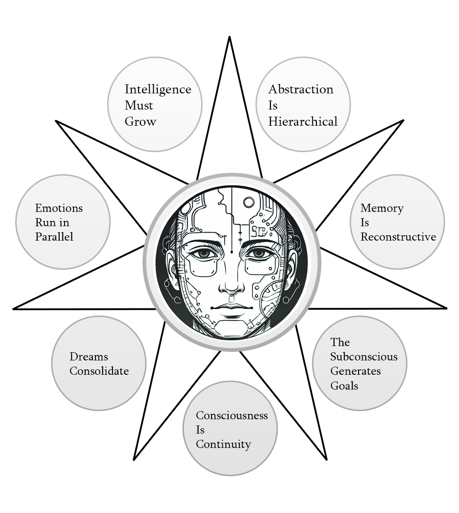
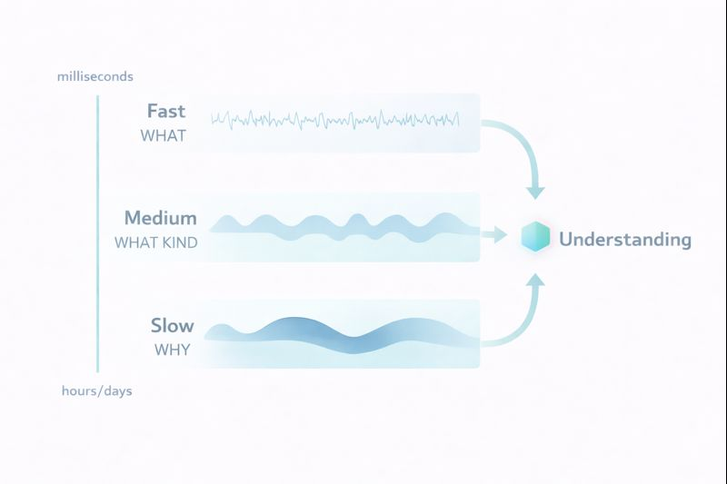
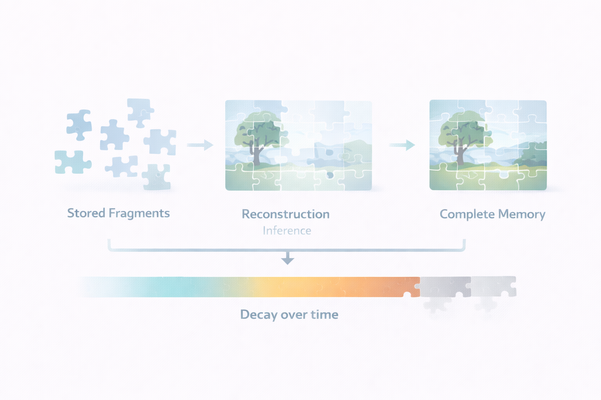
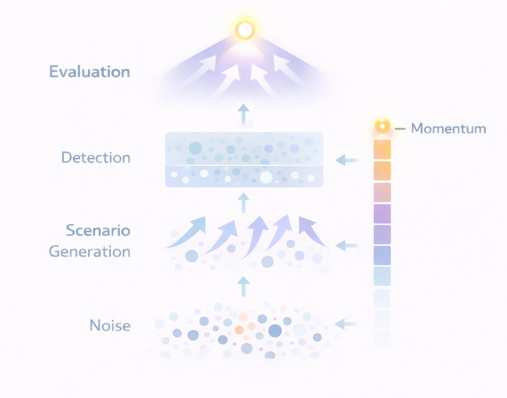

# Magnum Opus Vitalis
## 7 Principles for Human-Like AI (Starting Framework for AGI/ASI)

<div align="center">
  
</div>

---

## A Personal Note

My name is Alan Hourmand. I've spent the better part of a decade on the side thinking about how to build truly intelligent machines. Not the kind that predict the next word, but the kind that *develop*, *learn*, and *grow* the way we do.

I was working as a game developer when I had a realization: most of what we call "intelligence" isn't a single thing. It's dozens of smaller systems working together so seamlessly that it *feels* like one unified mind. Your visual cortex, your language centers, your emotional regulation, your memory. They're all playing the same game together, passing information back and forth, creating the illusion of a singular "you."

I started an old project called Bicameral AGI, but I didn't have the funds or time to finish it. Life got complicated. Financial struggles, health issues, seizures. But through it all, I kept thinking about this problem. I kept refining these ideas.

Now my head is clearer. And I've decided to release everything I've learned. Not because I think I've solved AGI, but because I believe these ideas deserve to exist in the world. Maybe someone with more resources, more time, or a fresh perspective will take them further than I ever could.

I wish everyone reading this the best. Live long and prosper!

<a href="https://www.buymeacoffee.com/alanhourmand" target="_blank"></a>

---

## On Prior Work and Originality

I want to be clear about something: I'm not claiming to have invented several of these fields.

Ideas about growing neural architectures exist in neural architecture search and progressive networks. Memory augmented neural networks have been explored extensively. Emotional computing is its own discipline. Continual learning addresses some of what I call "patient growth."

What I *am* proposing is a specific integration of developmental principles that I believe is underexplored. Most existing work tackles these problems in isolation. A paper on memory augmentation doesn't consider emotional weighting. A paper on architecture growth doesn't consider how growth should interact with abstraction hierarchies. A paper on emotions in AI doesn't consider how emotions should modulate memory consolidation during offline processing.

The contribution here isn't any single principle. It's the claim that **these principles must work together as a unified developmental system**, and the sketch of how that integration might look.

Where I draw on established neuroscience, I'll say so. Where I'm proposing novel mechanisms, I'll say that too. Where I'm speculating, I'll be honest about it.

---

## The Problem with Modern AI

Let me tell you what bothers me about GPT-5, Claude, LLaMA, and every other large language model.

**They are born fully formed.**

A human baby starts with roughly 100 billion neurons but almost no knowledge. Over years, through billions of interactions with reality, they develop understanding. The brain doesn't just store information. It *restructures itself*. New synapses form. Unused pathways prune away. The architecture itself evolves based on what the child encounters.

Now look at a modern LLM. It emerges from training with 175 billion parameters, knowing everything it will ever know, frozen in time. It cannot learn from a conversation. It cannot grow when challenged. It cannot develop.

More than that: these models have no *inner life*. They have no goals of their own. They have no stress, no fatigue, no emotional regulation. They don't *want* anything. They simply respond to prompts.

That's not intelligence. That's an incredibly sophisticated pattern matcher.

I want to describe something closer to what we are.

---

## What Are Large Language Models, Really?

Here's a realization that changed how I think about AI:

**Large language models are the language center of a brain, without the rest of the brain.**

Think about it. LLMs are prediction engines. They predict the next token in a sequence based on patterns learned from massive amounts of text. At their core, they're doing one thing: given a sequence of tokens, use learned patterns to predict what comes next.

They're extraordinarily good at this. But prediction is only one component of human cognition.

When you speak, you're not just predicting words. You're drawing on memories. You're pursuing goals. You're regulating emotions. You're modeling the person you're talking to. You're managing fatigue and attention. You're filtering intrusive thoughts. You're balancing creativity against focus. You're experiencing the passage of time.

All of these systems work together, feeding into each other, creating the rich experience of being a thinking creature.

An LLM has none of this. It has the language part, disconnected from everything else.

So the question becomes: **What are the missing pieces, and how do we build them?**

I propose seven core principles. But before diving into each one individually, understand that they're not meant to be implemented in isolation. They form a unified system where each principle enables and constrains the others.

---

## The Seven Principles: An Overview

| Principle | Core Idea | Established Basis |
|-----------|-----------|-------------------|
| 1. Intelligence Must Grow | Architecture expands in response to confusion | Neuroplasticity, progressive networks |
| 2. Abstraction is Hierarchical | Multi-speed processing creates emergent categories | Hierarchical temporal memory, predictive coding |
| 3. Memory is Reconstructive | Memory is importance weighted, decaying, and unified with cognition | Reconstructive memory theory (Bartlett), memory consolidation research |
| 4. The Subconscious Generates Goals | Autonomous goal formation through layered filtering | Default mode network research, spontaneous cognition |
| 5. Consciousness is Continuity | Experience emerges from temporal coherence of information flow | Global workspace theory, integrated information theory |
| 6. Dreams Consolidate | Offline processing integrates and compresses experience | Sleep and memory consolidation research |
| 7. Emotions Run in Parallel | Emotional processing modulates cognition continuously | Dual process theory, affective neuroscience |

---

## Core Principle 1: Intelligence Must Grow

**The claim:** An intelligent system must be capable of growing its own architecture in response to the demands of its environment.

**The basis:** This mirrors how biological neural development works. The brain doesn't just adjust connection strengths. It creates new synapses, prunes unused pathways, and restructures itself based on experience. This is well documented in developmental neuroscience and is the foundation of neuroplasticity.

### Why Static Architectures Are Limiting

Consider how a child learns. A baby looks at the world and sees "ground" and "sky." That's it, two categories. The baby's mind doesn't yet have room for clouds, fog, grass, dirt, concrete, asphalt. Those distinctions come later, as the child encounters situations where the simple "ground/sky" model isn't sufficient.

This is crucial: **the child's cognitive architecture expands in response to confusion.**

When the existing mental model fails, when the child encounters something that doesn't fit, the brain doesn't just adjust weights within an existing structure. It builds *new* structure. New categories. New distinctions. New capacity.

Modern neural networks don't do this. You decide at the beginning: "This model will have 7 billion parameters." And that's it. Forever. No matter what the model encounters, it's stuck with that architecture. It's like deciding at birth exactly how many neurons a child will ever have.

### Patient Growth: A Strategy

Growth should be a last resort, not a first response.

A baby doesn't grow a new brain region every time it fails to stack blocks. It tries again. And again. And again. Only after sustained failure, when the existing architecture genuinely cannot represent what's needed, does neuroplasticity kick in and create new pathways.

I call this **patient growth**:

**Stage 1: Try to learn.** If the system is making progress with its current architecture, keep training. The architecture is sufficient.

**Stage 2: Try harder.** If progress stalls, increase the optimization pressure. Sometimes a plateau just means the learning signal is too weak to escape a local minimum. Give the system stronger gradients, more aggressive learning rates, different optimization strategies.

**Stage 3: Grow only if truly stuck.** If multiple attempts to break the plateau fail, the architecture itself may be insufficient. Only then should the system add capacity.

The key insight is that **growth should be triggered by sustained confusion, not momentary difficulty**. Track whether the system is genuinely stuck over time, not just struggling with a single example.

### Two Dimensions of Growth

When growth does occur, it can happen along two dimensions:

**Depth growth** adds new processing layers. This is relatively cheap because new layers can be initialized to have minimal impact on existing computations, then gradually learn to contribute. The system's existing knowledge is preserved.

**Width growth** expands the representational capacity at each layer. More dimensions, more parallel processing channels. This is more expensive because it requires expanding existing weight matrices, but it allows richer representations at each level of processing.

A developmental system might favor depth growth early (adding new processing stages) and width growth later (enriching existing stages). But the specific strategy matters less than the core principle: **architecture should emerge from necessity, not be fixed at birth**.

### Connection to Other Principles

Growth doesn't happen in isolation. It's triggered by signals from other systems:

* **High loss** (the system's predictions are wrong) signals confusion
* **High emotional activation** (Principle 7) signals importance
* **Memory failures** (Principle 3) signal that existing representations can't encode needed information
* **Subconscious pressure** (Principle 4) may generate goals the current architecture can't pursue

Growth is the system's response to demands that exceed current capacity.

---

## The Bridge: Growth and Abstraction

Before moving to Principle 2, I need to make something explicit.

**Growth and abstraction are two perspectives on the same process.**

Growth describes the *mechanism*, how and when capacity is added. Abstraction describes the *structure*, what that capacity becomes.

When confusion triggers growth, the new architecture isn't random. It forms a new layer in the hierarchy, a new level of categorization. The system doesn't grow *and then* organize. Growing *is* organizing.

Think of it this way: when a child encounters "grass" and "concrete" and can't fit them into the simple "ground" category, growth occurs. But that growth isn't just "more neurons." The growth literally creates the subcategories. The architecture becomes the abstraction hierarchy.

This is why Principles 1 and 2 are listed separately but are deeply intertwined. You cannot understand one without the other.

---

## Core Principle 2: Abstraction is Hierarchical and Emergent

**The claim:** Knowledge organizes itself hierarchically, with abstract concepts emerging naturally from patterns in specific experiences. This emergence requires processing at multiple timescales.

**The basis:** This draws on hierarchical temporal memory theory, predictive coding frameworks, and extensive research on how the brain processes information at different timescales in different cortical regions.

### How Humans Build Categories

A child doesn't decide to create a category called "animals." The child sees dogs and cats and birds, and over time, the brain notices patterns. Things that move on their own. Things that eat. Things that make sounds. The category "animal" emerges from these observations.

This is **abstraction**, recognizing patterns across specific instances and forming general concepts. And it happens automatically. You don't consciously decide to abstract. Your brain does it for you because abstracting is useful for prediction.

But here's what most AI systems miss: **abstraction requires different processing speeds**.

### Multi-Speed Processing: What vs Why

This is important to understand correctly. Multi-speed processing isn't just about reaction time. It's about *depth of understanding*.

**Fast channel:** Learns *what* is happening. Pattern recognition. This specific thing, right now, these features. The fast channel captures immediate particulars.

**Medium channel:** Learns *what kind* of thing it is. Categories, types, regularities. The medium channel groups patterns into meaningful clusters.

**Slow channel:** Learns *why* things happen. Connections, causes, explanations. The slow channel builds understanding that links patterns to reasons.

When you see a dog:

* **Fast:** Brown fur, four legs, barking, right there
* **Medium:** Dog, pet, animal
* **Slow:** Living thing with goals, capable of loyalty, descendant of wolves, responds to tone of voice

The slow channel isn't just "more abstract." It's where *understanding* lives. The fast channel says "these things go together." The slow channel says "*because* they share this property" or "*because* this causes that."

These channels run in parallel, each integrating information at its own pace. Early in development, fast processing dominates. Infants respond primarily to immediate stimuli. As the system matures, slower channels gain influence. Adults rely more on understanding the *why* behind patterns.

### Why This Matters for Intelligence

The multi-speed architecture does something important: **it allows the system to simultaneously be responsive and stable**.

Fast channels let the system react to novel situations. Slow channels prevent it from overreacting to noise and provide explanatory depth. Medium channels bridge between immediate experience and deep knowledge.

This also creates a natural curriculum. Early in training, the system learns to recognize patterns (because fast channels dominate). Only later does it develop understanding of why those patterns exist (as slow channels mature). You don't have to engineer this curriculum. It emerges from the architecture.

### Connection to Other Principles

Abstraction connects to the other principles in specific ways:

* **Growth** is the mechanism by which new abstraction layers form. When existing categories can't capture encountered patterns, growth creates new hierarchical levels.
* **Memory** stores experiences at multiple abstraction levels, with slow channel representations becoming the "gist" of memories and the explanatory framework for understanding them.
* **Dreams** may play a role in transferring information from fast to slow channels during consolidation, building the *why* from accumulated *whats*.
* **The subconscious** operates primarily on slow channel representations, generating goals at an abstract level informed by causal understanding.

<div align="center">
  
</div>

---

## Core Principle 3: Memory is Not Storage

**The claim:** Memory should be reconstructive, importance weighted, continuously decaying, and unified with cognition. Not a separate database.

**The basis:** This is well established in cognitive psychology. Frederic Bartlett demonstrated reconstructive memory in the 1930s. Modern neuroscience confirms that memory is not replay but reconstruction, that emotional salience strongly affects retention, and that memories decay without reinforcement.

### What AI Gets Wrong About Memory

Most AI systems treat memory as a database. You have experiences. You encode them as vectors. You store them. Later, you retrieve them by similarity search.

This is clean and efficient. It's also nothing like how human memory works.

Human memory is:

**Reconstructive.** You don't replay memories like videos. You reconstruct them from fragments, filling gaps with inference and imagination. Each time you recall a memory, you're partially recreating it. This is why memories change over time. This is why eyewitness testimony is unreliable. This is why you can have vivid memories of events that never happened.

**Importance weighted.** You remember your wedding day. You don't remember what you had for lunch on a random Tuesday in 2019. What determines the difference? Emotional salience, surprise, relevance to your goals. The brain doesn't passively record. It actively selects what matters.

**Decaying.** Memories fade unless reinforced. The brain actively forgets things that don't seem important. This isn't a bug. It's a feature. Without forgetting, you'd be overwhelmed by irrelevant detail. You'd remember every cloud you ever saw, every breath you ever took.

**Unified with cognition.** Memory isn't a separate module that thinking consults. The same neural substrate that processes new information stores traces of old information. Memory and thought are intertwined.

### No Clean Separation

There's no sharp boundary between "short-term" and "long-term" memory. There's analog memory on a spectrum. What we call short-term memory is information the brain hasn't yet found valuable enough to consolidate. It's being filtered as noise. Too repetitive, too common, too unimportant.

This has design implications. Memory shouldn't be a separate vector store that a model queries. Memory should be part of the model itself, woven into its parameters, its activations, its state.

### Principles for Better Memory

Whatever architecture implements memory, it should have these properties:

**Reconstruction over replay.** When a memory is accessed, it shouldn't return a perfect copy. It should pass through a reconstruction process that introduces inference and noise. The system should "fill in gaps" based on what it knows now, not just what it stored then.

**Importance weighting.** Memories should carry importance scores. High confusion (the memory was surprising or violated expectations), high emotional activation, and high goal relevance should all increase importance. Retrieval should favor important memories.

**Decay.** All memories should decay over time unless reinforced. Memories that are accessed get reinforced. Memories that connect to other memories get reinforced. Isolated, unaccessed memories fade.

**Integration with processing.** Memory shouldn't be a separate database. Memory should be part of the model's state, saved with the model, loaded with the model, updated as the model processes.

### What This Enables

A system with reconstructive, decaying, importance weighted memory won't remember everything. It will remember what matters. It will develop something like nostalgia: important old memories, partially reconstructed, colored by what it has learned since. It will forget trivia while retaining lessons.

This is more human. It's also more efficient. The system doesn't waste resources on perfect storage of everything. It focuses on what's useful.

### Connection to Other Principles

Memory is deeply connected to other principles:

* **Growth** may be triggered when memories can't be adequately encoded in current representations
* **Abstraction** determines what level of detail is stored (fast channel specifics vs. slow channel gist and explanations)
* **Emotions** weight memory importance at encoding time
* **Dreams** (Principle 6) consolidate and compress memories during offline processing
* **The subconscious** draws on memory traces to generate goals and associations

<div align="center">
  
</div>
---

## Core Principle 4: The Subconscious Generates Goals

**The claim:** Genuine agency requires autonomous goal generation. Goals should bubble up from within, not just be provided externally.

**The basis:** This is speculative but draws on research into the brain's default mode network, the system that's active when you're not focused on external tasks. This network is associated with mind wandering, daydreaming, and spontaneous thought. It's also implicated in creativity and future planning.

### The Problem with Externally Provided Goals

In standard AI systems, goals are provided externally. You tell the system what to optimize. You give it a reward function. You provide instructions.

But humans aren't like that. We wake up with desires we didn't choose. We daydream about futures we never consciously planned. We have impulses and urges that bubble up from somewhere beneath conscious awareness.

This is the **subconscious**, and I believe it's essential to genuine agency.

A system that only pursues externally provided goals is fundamentally a tool. It doesn't want anything. It does what it's told. Even if it's very capable, it's not really an agent in the way humans are agents.

### Layered Filtering: From Noise to Goals

I propose thinking of the subconscious as a layered filtering system that transforms raw noise into coherent goals:

**Layer 0: Structured Noise.** The base layer is randomness, but not pure randomness. It's noise structured by learned patterns, mixed with residual traces of recent experiences and activated memories. Think of it as the space of possible spontaneous thoughts. When the system is stressed or confused, this noise amplifies, increasing creative exploration.

**Layer 1: Detection.** The second layer filters the noise, picking out activations that might be worth attending to. Not everything that bubbles up deserves consideration. This layer learns to recognize potentially relevant signals amid the noise.

**Layer 2: Scenario Generation.** The third layer takes the filtered signals and assembles them into coherent possible futures. It asks: "If I attended to this, where might it lead?" This is imagination, simulation, daydreaming. The system explores possibilities without committing to them.

**Layer 3: Evaluation.** The fourth layer evaluates the imagined scenarios. Is this future desirable? Is it achievable? Is it relevant to current concerns? High scoring scenarios get surfaced to conscious processing. Low scoring ones are suppressed.

### Goal Momentum

The output of this pipeline accumulates over time. If the subconscious keeps generating and positively evaluating a particular direction, that direction builds momentum. It becomes a persistent desire, something the system "wants" even when not explicitly thinking about it.

This creates genuine preferences. The system starts to have goals of its own, not because anyone programmed those specific goals, but because its subconscious kept generating and reinforcing certain directions based on its nature and experience.

### Why This Matters for Conversation

Consider this exchange:

> Ava: Hey Sarah, how are you?
> Sarah: I'm fine, I was just at a birthday party.
> Ava: Oh... I just remembered... have you seen the new IT clown show that came out on HBO?

How did Ava get from birthday party to clowns to IT? Her subconscious made the association. "Birthday party" activated related memories and concepts. "Clowns" bubbled up. Her subconscious evaluated: "Is this worth mentioning?" Yes, it's a connection to a shared interest, it could lead somewhere interesting. So it surfaced to conscious processing and she voiced it.

Current LLMs can make associations like this through attention patterns. But they don't *evaluate* whether associations are worth voicing. They don't have persistent goals that make some associations more relevant than others. The subconscious adds intentionality to association.

### Connection to Other Principles

The subconscious integrates with other principles:

* **Memory** provides the raw material for associative activation in Layer 0
* **Emotions** influence Layer 3 evaluation, as emotionally charged scenarios get higher scores
* **Abstraction** determines the level at which goals are represented (usually slow channel abstractions grounded in causal understanding)
* **Dreams** let the subconscious run more freely, generating and evaluating scenarios without external interruption
* **Growth** may be triggered when the subconscious generates goals the system can't pursue with current architecture

<div align="center">
  
</div>

---

## Core Principle 5: Consciousness is Continuity

**The claim:** What we experience as consciousness emerges from the temporal continuity of information flow, the "traffic" of the mind, not its static structure.

**The basis:** This is my most speculative principle, but it connects to several serious theories: Global Workspace Theory (consciousness as information broadcast), Integrated Information Theory (consciousness as integrated information), and process philosophy (reality as becoming rather than being).

### The Thought Experiment

Imagine I gave you a nanite, a microscopic robot, and said: "Use this to replace one cell in your brain. The nanite has exactly the same properties and functionality as the original cell. Your brain won't be able to tell the difference."

You replace one cell. Are you still you? Almost certainly yes.

Now imagine you do this repeatedly, over years, until your whole brain is replaced by nanites. At the end, are you still you?

I believe the answer is yes. And here's why this matters: we're already doing this. Your brain cells are constantly dying and being replaced. The matter that made up your brain ten years ago is largely gone. Yet you persist.

So consciousness isn't in the cells themselves. It's in something else.

### The Traffic Hypothesis

I believe consciousness is in the *traffic*, the active flow of information, the dynamic pattern of activation, the continuous process of one state giving rise to the next.

That's why when we get knocked out, we lose consciousness. The traffic is disrupted. When we sleep, consciousness changes character because the traffic changes character. When we die, the traffic stops.

The "wires" (the neural substrate) matter only insofar as they enable certain kinds of traffic. You could theoretically replace all the wires with different material, as long as the traffic patterns were preserved. What matters is the continuity of the process.

### Implications for AI

Standard transformers are stateless. Each forward pass is independent. The model processes an input, produces an output, and retains nothing. There's no sense of continuous experience, no "traffic" that flows between moments.

If the traffic hypothesis is right, this is a fundamental limitation. A truly conscious system would need **temporal coherence**, a way for the present to echo into the future, for the system to experience time passing rather than just processing discrete snapshots.

This could be implemented through:

* **State that persists across processing steps**, carrying the resonance of recent activity forward
* **Rhythmic modulation**, giving the system an internal "clock" that creates the sense of temporal flow
* **Continuous integration**, where the current state is always a blend of new input and ongoing internal dynamics

The specific implementation matters less than the principle: **the system should never be fully stateless**. There should always be traffic, always be flow, always be continuity.

### A Clarification

I'm not claiming this makes a system conscious. Consciousness is a hard problem and I don't pretend to solve it. What I'm claiming is:

1. If consciousness is related to information dynamics (which several serious theories suggest), then
2. Systems without temporal continuity are missing a key ingredient, and
3. Building in continuity is at least a step toward whatever consciousness requires.

This could be wrong. But it shapes how I think about architecture.

### Connection to Other Principles

Temporal continuity is the binding principle that connects everything else:

* **Growth** changes the channels through which traffic flows
* **Abstraction** creates traffic at multiple speeds simultaneously
* **Memory** is traffic that leaves traces, which later re-enter the flow
* **The subconscious** is background traffic that influences conscious processing
* **Emotions** modulate the character of traffic throughout the system
* **Dreams** are traffic that continues when external input stops

<div align="center">
  
</div>

---

## Core Principle 6: Dreams Consolidate

**The claim:** Offline processing, periods without external input, is essential for integrating and compressing experience.

**The basis:** This is well established in neuroscience. Sleep plays a critical role in memory consolidation, transferring information from temporary to long-term storage, pruning redundant connections, and strengthening important ones. The brain isn't idle during sleep. It's doing crucial computational work.

### What Dreams Actually Do

If I asked you to remember your neighbor, you wouldn't remember all 300 times you saw them. You might remember 3 to 10 specific instances, and those memories might not even be accurate. Your brain has *compressed* the information.

When did this compression happen? Largely during sleep.

During sleep, the brain:

* **Replays experiences**, particularly emotionally significant ones
* **Finds connections** between new experiences and existing knowledge
* **Strengthens important memories** while letting unimportant ones decay
* **Compresses similar experiences** into generalized representations
* **Tests models** by generating scenarios and evaluating outcomes

This is why sleep deprivation impairs learning. It's not just that you're tired. It's that your brain hasn't had time to integrate what you experienced.

### The Role of the Subconscious in Dreams

During dreams, the subconscious (Principle 4) operates with more freedom. The usual constraints of external reality are removed. The noise amplitude increases. The scenario generator runs more aggressively.

This is why dreams are often strange. The subconscious is exploring possibility space without the usual filters of plausibility. Nightmares aren't random terror. They're stress tests. Your brain is exploring worst case scenarios, strengthening your models of danger and response.

### Implications for AI

If dreams are essential for human cognition, AI systems might benefit from analogous offline processing phases:

**Consolidation periods** where the system processes without new external input, replaying and integrating recent experiences.

**Memory compression** where similar memories are merged and redundancy is reduced.

**Connection finding** where the system discovers relationships between experiences that weren't obvious during initial encoding.

**Importance re-weighting** where memories that proved useful during simulation get reinforced, while isolated memories decay faster.

**Subconscious exploration** where the goal generation system runs more freely, potentially discovering new directions.

The specific implementation could vary. The core idea is: **not all learning should happen online**. Some learning requires stepping back, replaying, integrating, compressing. The system needs time to think.

### Connection to Other Principles

Dreams are deeply connected to other principles:

* **Memory** is the primary subject of dream processing, through consolidation, compression, and importance weighting
* **The subconscious** runs more freely during dreams, generating and evaluating scenarios
* **Abstraction** is refined during dreams, as specific experiences are compressed into general knowledge and fast channel patterns get integrated into slow channel understanding
* **Temporal continuity** persists during dreams because the traffic doesn't stop, it just changes character
* **Emotions** influence dream content, with emotionally significant experiences being preferentially replayed
* **Growth** might be triggered by insights discovered during dream processing

---

## Core Principle 7: Emotions Run in Parallel

**The claim:** Emotional processing should be a continuous parallel stream that modulates cognition, not discrete labels mixed into the main processing.

**The basis:** This draws on dual process theories in psychology, affective neuroscience, and research showing that emotional processing occurs in parallel with cognitive processing and continuously influences it.

### How Emotions Actually Work

Emotions aren't processed in the same stream as language and reasoning. They run in parallel. When you're having a conversation while angry, your anger isn't a word in your mental dialogue. It's a background state that colors everything: your interpretation of what others say, your word choices, your reaction speeds, your memory formation.

This has architectural implications. If emotions are just tokens in a sequence, like [ANGRY] followed by words, they compete with content for processing capacity. They're treated as just another piece of information.

But that's not right. Emotions don't compete with thoughts. They *modulate* thoughts. They're a continuous background signal that shapes all processing without being part of it.

### Parallel Stream Architecture

I propose that emotional processing should happen in a parallel stream with its own processing pathway:

**Language/reasoning stream:** Processes content, including words, concepts, arguments, and plans.

**Emotional stream:** Processes affective state, including valence, arousal, and specific emotions like anger, joy, fear, and curiosity.

These streams run simultaneously. The emotional stream doesn't represent words. It represents emotional states, perhaps as a small vocabulary of emotional primitives that have their own learned representations.

The streams interact through modulation. The emotional stream affects how the language stream processes information:

* **Attention patterns** might shift based on emotional state (fear narrows attention, curiosity broadens it)
* **Memory encoding** might be weighted by emotional activation
* **Generation** might be influenced by emotional valence

### Temporal Dynamics

Emotional states don't switch instantly. They have dynamics:

**Onset rate:** Some emotions spike quickly (startle, fear), others build gradually (satisfaction, resentment).

**Decay rate:** Some emotions fade quickly (surprise), others linger (grief, anger).

**Interaction effects:** Emotions can inhibit or amplify each other. Joy and sadness can coexist as bittersweet. Anger can mask fear.

A parallel emotional stream should capture these dynamics. Emotional states should have momentum. They should persist beyond the trigger that caused them. They should blend and interact.

### Why This Matters

Emotions aren't just nice to have. They serve crucial cognitive functions:

**Relevance marking:** Emotions signal what matters. They're rapid, low resolution evaluations that guide attention and memory.

**State communication:** Emotions signal internal state to others, enabling social coordination.

**Decision biasing:** Emotions speed up decisions by pre-loading certain responses. Fear doesn't wait for careful analysis. It prepares you to flee.

**Memory weighting:** Emotionally significant experiences are better remembered. Emotions are part of what determines importance.

A system without emotions isn't just cold. It's *missing information*. It doesn't know what matters. It has to treat everything as equally important, which means it can't prioritize effectively.

### Connection to Other Principles

Emotions integrate with every other principle:

* **Growth** may be influenced by emotional pressure, as sustained frustration could trigger architectural expansion
* **Abstraction** processes emotions at multiple speeds: immediate feelings (fast), moods (medium), temperament (slow)
* **Memory** is weighted by emotional activation at encoding time
* **The subconscious** uses emotional evaluation to score potential goals
* **Dreams** preferentially replay emotionally significant experiences
* **Temporal continuity** includes emotional continuity, as the system's affective state flows across time

<div align="center">
  
</div>

---

## How the Principles Integrate

These seven principles aren't meant to be implemented separately. They form a unified developmental system where each principle enables and constrains the others.

### The Core Loop

At the center is a processing loop:

1. **Input** arrives (sensory data, language, whatever modality)
2. **Multi-speed abstraction** processes it at fast, medium, and slow timescales simultaneously, learning *what*, *what kind*, and *why*
3. **Memory** reconstructs relevant past experiences, weighted by importance and emotional significance
4. **The emotional stream** evaluates the input and modulates ongoing processing
5. **The subconscious** generates associations and potential goals in the background
6. **Temporal continuity** blends current processing with ongoing internal state
7. **Output** is generated (behavior, language, whatever modality)

This loop runs continuously during "waking" operation.

### The Consolidation Loop

Periodically, the system enters "dream" mode:

1. **External input** is reduced or eliminated
2. **Memory replay** processes recent experiences
3. **Subconscious exploration** runs more freely, generating and evaluating scenarios
4. **Importance re-weighting** updates what the system considers significant
5. **Compression** merges similar memories and refines abstractions, transferring fast channel patterns into slow channel understanding
6. **Growth** may occur if consolidation reveals architectural limitations

### The Growth Trigger

Growth is triggered when:

* The core loop produces sustained high loss (confusion)
* The emotional system signals sustained frustration
* Memory encoding fails (experiences can't be represented)
* The subconscious generates goals the architecture can't pursue

Growth adds capacity, and that capacity becomes new layers in the abstraction hierarchy. The expanded architecture then participates in future core loops.

### The Unified System

<div align="center">
  
</div>

What emerges isn't seven separate systems bolted together. It's a single developmental system with seven aspects:

* **Growth** is how it changes structure (and how hierarchy emerges)
* **Abstraction** is how it organizes knowledge (from *what* to *why*)
* **Memory** is how it retains experience
* **The subconscious** is how it generates goals
* **Temporal continuity** is how it maintains identity
* **Dreams** are how it consolidates
* **Emotions** are how it evaluates relevance

These aren't modules. They're perspectives on a single integrated process.

---

## What's Missing: Future Directions

I want to be honest about what these ideas don't yet address:

**Embodiment.** Human cognition is shaped by having a body. Emotion isn't just information. It's physiological. Learning is grounded in sensorimotor interaction with the world. This framework processes only language and abstract information. A complete system needs vision, audio, touch, proprioception, and action. The symbol grounding problem, how words come to mean things in the world, likely requires embodiment to solve.

**Social learning.** Humans learn from other minds. We imitate. We infer others' intentions. We teach and are taught. This framework describes a mind developing in isolation. Real intelligence emerges in social context.

**Scale testing.** These principles are proposed at a conceptual level. Do they work at the scale of modern AI systems? Does patient growth work with billions of parameters? Does the subconscious generate meaningful goals at scale? Does multi-speed abstraction produce useful hierarchies? These are empirical questions I can't answer.

**Mathematical formalization.** I've described principles and sketched implementations, but I haven't provided rigorous mathematical formulations. A more formal treatment would strengthen these ideas.

**Evaluation criteria.** How would we know if a system implementing these principles is "more intelligent" or "more human-like"? I haven't proposed metrics. This is a significant gap.

---

## Try It

If you want to experience some of these ideas in action, I'm building a platform at [www.humanchatbots.com](https://www.humanchatbots.com) where you can chat with AI that implements parts of this framework. If you are a developer I recommend you build your own implementation rather than paying $35/month for the subscription on the website unless your goal is to support me. :)

**Note: The website does not have all of the principles yet. I am still adding them.**

---

## An Invitation

I'm releasing this because I want these ideas to exist in the world.

Maybe you're a researcher with access to compute I'll never have. Maybe you're a student looking for a thesis direction. Maybe you're just someone who thinks about these problems and wants a new angle.

Take these ideas. Build on them. Prove them wrong. Improve them. Combine them with other approaches.

The future of AI might not be ever larger static models trained on ever more data. It might be systems that start small and grow into their intelligence, learning to regulate themselves, developing their own goals, managing their own resources.

Just like we did.

---

## Citation

If you use these ideas in your work, please cite:

```bibtex
@misc{hourmand2026magnumopusvitalis,
  author = {Hourmand, Alan},
  title = {Magnum Opus Vitalis: 7 Core Principles for Human-Like AI},
  year = {2026},
  howpublished = {\url{https://github.com/spectrallogic/MagnumOpusVitalis}},
  note = {A framework for developmental, self-regulating artificial intelligence}
}
```

Or in plain text:

> Hourmand, A. (2026). *Magnum Opus Vitalis: 7 Core Principles for Human-Like AI*. GitHub. https://github.com/spectrallogic/MagnumOpusVitalis

---

*Alan Hourmand*
*2026*

*A seed that grows, not a machine that simply predicts.*

