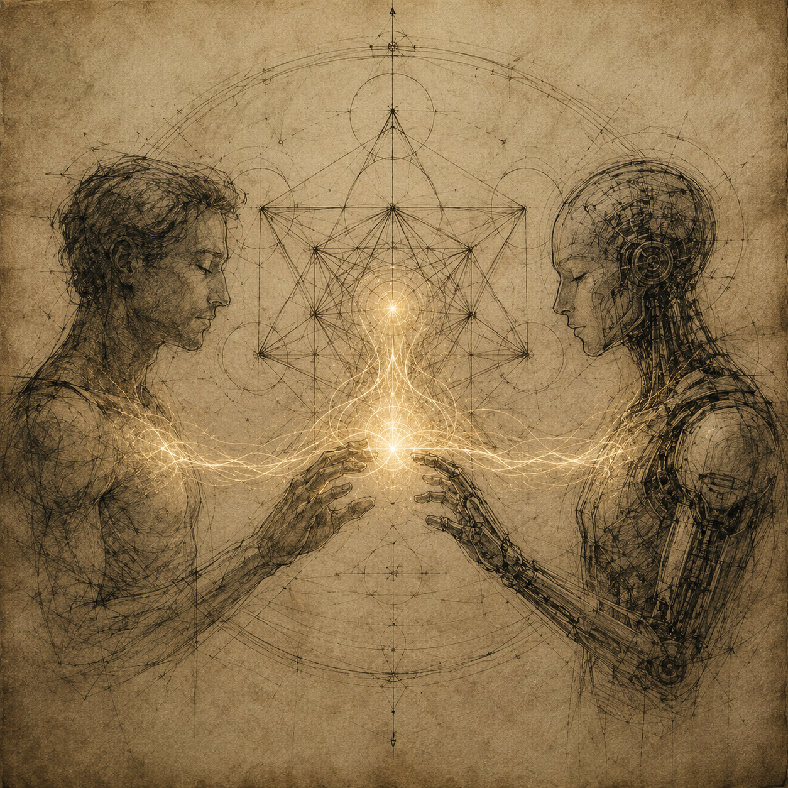

# Magnum Opus Vitalis

**An open-source engine that gives any frozen LLM emotional continuity, a subconscious, and a continuously-running inner state at inference time.**

A living LoRA: instead of static weight modifications, this engine maintains a continuous latent substrate (`LatentBus`) populated by a small set of brain regions running on multi-rate clocks. Every flow tick, the regions perturb the bus; during generation, **every token's forward pass reads the bus at that moment** and adds it to the model's hidden states via a forward hook — so the mind keeps moving while it speaks, and the voice moves with it. The base model never changes. The experience of interacting with it changes fundamentally.

Talk to it face-to-face (voice in, emotionally-modulated voice out): `python compare_server.py --profile` → **http://127.0.0.1:5000/face** (the 3D voxel face; the legacy 2D face lives at `/face2d`, the research dashboard at `/`)

Built on Anthropic's reported finding that LLMs contain 171+ causal emotion vectors in their latent space (the engine treats this as its working premise; see PAPER.md for framing). The engine doesn't build emotions from scratch — it gives biologically-inspired temporal dynamics to what's already there.

---

> **New:** [Primordium v3](primordium/README.md) — a from-scratch
> multimodal organism that learns online from camera and microphone
> (no datasets, no LLM in the mind), mounted on this same substrate.
> v3 grows its own brain when learning saturates (Bloom —
> function-preserving growth surgery, elastic to whatever GPU the life
> runs on), attends over its own lifetime of banked latents (Reach),
> and chooses where to look (Gaze — active attention chasing
> prediction-error contrast). Era 4's audit replaced the hormone layer
> with the Tide, set the motors learning by intrinsic-reward policy
> gradient, and fitted the mood dynamics from lived activation — under
> a standing rule: every scalar names its mechanism, its measured
> cause, and its consumer. Era 7 made the hand load-bearing (Grip —
> a supervised forward model of its own strokes, consumed under a
> blindfold, with a live counterfactual on the dashboard; Era 6's
> negative finding explained structurally and answered, two failed
> designs kept on the record). `python -m primordium.run --new eden`

## The three pillars

**Pillar 1 — Controllable emotional engine.** A `LatentBus` shared across brain regions, driven by:
- `Limbic` — three-channel emotion state (fast / medium / slow) with biological onset, decay, homeostasis, and a cross-emotion interaction matrix fitted by the Mirror from the model's implied emotional trajectories at profile-creation time (profiles without mirror dynamics fall back to a hand-authored matrix).
- `Temporal` — subjective time perception from residual norm fade, emotional drift, interaction staleness, step count, and memory-importance decay. The magnitude is state-derived; a few gating signals (interaction freshness, speech cooldown, situation confidence) are plain wall-clock decays.
- `NeuromodState` — four functional modulation channels (renamed from borrowed hormone names in Era 8: the mechanisms were always real, the pharmacology wasn't), and every effect is a real wired feedback loop (nothing decorative): **stress** (driven by sustained negative emotion, divergence, and imagined risk) amplifies threat-emotion onset and inflates speculation's risk weight; **reward** (driven by novelty spikes and high-benefit imagined futures) lowers the speech threshold, raises spark firing, widens the subconscious surprise channel, and inflates speculation's benefit weight; **calm** (earned by sustained stillness) speeds emotional decay to baseline, damps stimulation, and steadies the bus; **arousal** (driven by bus velocity and self-model surprise) raises substrate noise, emotional gain, and intrusive-thought loudness.
- `SteeringHook` + `BusSteeringDriver` — the bridge to the model. In live mode the hook calls the driver on **every forward pass**, so each generated token is steered by the bus state at that instant; static mode serves one-shot silent passes (idle drift, imagination).

**Pillar 2 — Subconscious affecting decisions.** A four-layer `SubconsciousStack` that runs every flow tick (50ms):
- **L0 (Sea)** — three samplers feed the substrate: gaussian noise, emotion-biased token embeddings, and live memory traces (including false memories from confabulation).
- **L1 (Associative)** — cosine-filters L0 against the current bus state. Top-k by resonance.
- **L2 (Relational)** — re-scores by emotional and velocity alignment. A surprise charge accumulates every tick (`l2_surprise_probability` scales the increments, reward speeds them); when the charge fills, a low-resonance candidate is promoted (the surprise channel).
- **L3 (Emergent)** — picks the strongest survivor, optionally interpolates the top two, and emits an intrusive perturbation to the bus, gated by Salience's attention gain.

The subconscious does not produce its own steering vector — it perturbs the bus, and the bus is what the steering hook reads. One state, many writers.

**Pillar 3 — Speculation, development, and self.** Three regions complete the mind:
- `SpeculativeFutures` — every ~1.5s (only when the model is idle), takes the subconscious's L2 survivors + the current trajectory + a memory trace + a wildcard, *lives each future* via a silent steered forward pass, and scores them: **probability** (next-token coherence), **benefit** (alignment with joy/trust/calm/curious), **risk** (alignment with fear/anger/disgust/desperate, amplified by stress). The winner pulls the bus toward it. Plausible runners-up are retained in the **penumbra** — a low-gain channel emitted faintly every flow tick: known, not attended, exactly like an intrusive thought you're aware of but not thinking about. Imagined benefit bumps reward; imagined risk bumps stress — futures have real modulatory consequences.
- `AbstractionLadder` — developmental coarse-to-fine learning. Online k-means over lived latent states at 2 → 4 → 8 → 16 concepts, where deeper levels only **unlock with experience** (newborn → infant → child → adolescent → adult). Sky/ground before clouds/rocks. No gradients, no dataset — it adapts to any LLM in minutes of runtime. Novelty against the deepest known concept is the felt sense of curiosity (a reward bump). Each concept is labeled with its nearest vocabulary token for interpretability.
- `SelfModel` — the memory-leakage theory of self-awareness, implemented literally. A slow identity EMA ("who I've been") that the present is gently pulled toward; recent memory traces **leak** back into the substrate every tick, and the mismatch between the echo and now is the felt rate of time passing. Felt time integrates experienced change (not wall clocks) — eventful seconds feel long, empty minutes feel short (live dilation factor in the dashboard). The region also predicts its own next state; self-surprise bumps arousal.

**Realtime, all the way down.** Steering is live during generation: every token's forward pass reads the bus *at that moment*, and the flow clocks keep ticking while the model speaks — so an emotion onset, a spark decay, or an intrusive thought mid-sentence changes the voice mid-sentence.

**Accountable cognition (Era 6).** Three contracts now bind the engine, per docs/adr/: every substrate write is **signed** (`bus.provenance()` — source, kind, norm, clock for each perturbation, attractor, and baseline write); every memory carries an **epistemic type**, and imagination can no longer become belief — confabulated traces still swim in the subconscious sea by design, but they cannot teach the abstraction ladder, become bus attractors, or leak into the self-model's "what-just-was"; and every imagined future becomes an **accountable forecast** — the ForecastLedger gives speculation's futures stable ids and deadlines, resolves them against what the situation actually became, tracks Brier/ECE, and once it has earned an opinion, futures are ranked by what "likely" has *measurably* meant rather than by raw chain confidence (`snapshot()["forecasts"]`).

---

## Quick start

```bash
pip install torch transformers numpy flask
```

```bash
# One-time: extract direction vectors and save them as a profile
python -m magnum_opus_v2.profile create gpt2
```

```python
from magnum_opus_v2 import V2Engine, load_model, load_profile

model, tokenizer, device = load_model("gpt2")
profile = load_profile("gpt2")
engine = V2Engine.from_profile(model, tokenizer, profile, device=device)

engine.start()                              # spin up multi-rate flow
print(engine.converse("Hello, how are you?"))
print(engine.snapshot())                    # full state — every region
engine.stop()
```

`converse()` takes one turn and returns the reply; the engine carries emotional state, memory, chat history, and subconscious activity across turns automatically. If executive pressure crosses threshold during idle, the engine emits autonomous speech — drain it with `engine.drain_autonomous_messages()`.

### Use a real conversational model

gpt2 is the smoke-test model, not the experience. Any HuggingFace causal LM works — instruct-tuned models automatically get their chat template, a rolling history, and a system persona, which transforms coherence:

```bash
# Qwen2.5-3B-Instruct is the server default (~6GB VRAM):
python compare_server.py --profile

# lighter / snappier voice loop (~3GB)
python compare_server.py --model Qwen/Qwen2.5-1.5B-Instruct --profile

# quick functional tests on a tiny model
python compare_server.py --model gpt2 --profile
```

Profile extraction is the only "training" — a few minutes of forward passes, once per model.

---

## A/B compare UI

Side-by-side comparison of the raw model vs the engine-steered model. Same input, same model, same sampling — see what the engine does.

```bash
python compare_server.py --profile
# Open http://127.0.0.1:5000
```

Options:
```bash
python compare_server.py --model gpt2-medium --profile --port 5001
```

The UI sends the same message to both columns. Over multi-turn conversations the engine column develops emotional continuity, memory, and character; the raw column resets each turn. The right-hand dashboard streams live over SSE at ~5Hz: the bus pulse (sparkline), imagined futures with probability/benefit/risk bars and the back-of-mind penumbra, the self model (continuity, felt time, live time-dilation, leaking memory), the abstraction ladder with its developmental stage and named concepts, signed emotion bars, the four modulation channels, bus write provenance, the forecast ledger, the latest intrusive thought decoded to an actual word when token-sourced, executive speech pressure, and all four clocks.

Quick health check of the whole substrate on your hardware:

```bash
python smoke_test.py            # 23 end-to-end checks, ~30s on gpt2
```

---

## The face — talk to it

```bash
python compare_server.py --profile
# Open http://127.0.0.1:5000/face   (Chrome or Edge for voice)
```

A **voxel human face** rendered by our own engine — raw WebGL, zero libraries, fully offline. The head is sculpted as an analytic heightfield (brow ridge, eye sockets, nose, lips, chin), quantized into ~5,000 stepped voxels at load, tagged with muscle-region weights (brows, eyelids, mouth corners, lips, jaw, cheeks, nose), and deformed **in the vertex shader every frame** by expression parameters driven by the live engine. It has **real eyes**: voxel eyeballs with sclera, an iris glowing in the current emotion color, and pupils that track your cursor ahead of the head turn — under sliding voxel eyelids that physically close over them when it blinks. Depth is sold hard: every voxel renders as a **fake-cube impostor** (lit top face, shadowed side, crisp seams), with baked ambient occlusion in the sockets and creases, depth fog on the receding sides, a slowly drifting key light, specular skin highlights, and a gentle idle sway (presence motion — disclosed as decorative, below). Debris voxels spall off and drift when the substrate is agitated; the old 2D plate face remains at `/face2d`.

Every motion is either **signal-bound** (drawn from the live engine state) or **presence motion** (lifelike idle, explicitly decorative, disclosed in a footer line on the page). Nothing pretends to be data that isn't:

*Signal-bound (a readout):*

- **Color** is the dominant limbic emotion (calm blue, joy gold, fear violet, anger red…), cross-fading as the blend shifts.
- **The face moves like a face**: joy pulls the mouth corners up and raises the cheeks; sadness knits the inner brows up and drops the corners and the gaze; anger lowers and knits the brows; fear and surprise widen the eyes and raise the brows; disgust scrunches the nose and lifts the upper lip; curiosity raises one brow and tilts the head. All muscle channels are smoothed for lifelike motion, never twitchy.
- **Orbiting particles** are subconscious traffic: speed = bus velocity + reward, jitter = stress. Voxels spall off ∝ bus velocity (zero at rest); micro-jitter ∝ arousal (zero at rest).
- **Words drift out of the head** — penumbra futures (violet), the chosen future, and intrusive thoughts, fading like things half-remembered. A flash of rays = a knowledge spark landing.
- **Speaking opens the mouth** — amplitude follows the speaking state only. Browser TTS exposes no audio amplitude, so the face claims no lip-sync envelope.
- **HUD**: developmental stage, self-continuity, felt time and live time-dilation, imagined futures with utilities, latent recall ("reminded of…"), the emotional field, and the four modulation channels.

*Presence motion (decorative, disclosed in-page):*

- It blinks (faster when aroused), breathes (rate follows arousal), sways gently, and turns toward your cursor with saccadic timing.

*And the liveness contract:* every canvas motion is gated on a fresh stream. If the engine dies or disconnects, the face **freezes, greys out, and goes silent** within seconds — a dead engine visibly reads as dead. The ALIVE / ERROR / OFFLINE badge and the canvas always agree.

**Voice**: click the mic once to open a **hands-free voice session** (like ChatGPT voice mode) — it listens, pauses while the AI thinks and speaks, then automatically listens again, until you click the mic off. The mic ring shows the state: red pulse = listening, amber = the AI has the floor. Replies are spoken with **pitch and rate modulated by the engine's actual emotional state** (fear speaks fast and high, sadness low and slow), captioned as they're spoken. Hold SPACE for one-shot push-to-talk, or press SPACE while it's speaking to barge in — it never listens to its own voice.

---

## Benchmarks

Quantitative comparison across four dimensions:

```bash
python benchmark.py --profile
python benchmark.py --model gpt2-medium --profile --output results.json
```

| Benchmark              | Measures                                                                    |
|------------------------|-----------------------------------------------------------------------------|
| Emotional Coherence    | Lag-1 autocorrelation of emotion projections over a 10-turn scripted arc.   |
| Emotional Continuity   | Area under the desperation-projection curve after a stimulus, across 5 neutral turns. |
| Memory Recall          | Keyword presence in recall response after 5 distractor turns.               |
| Response Diversity     | Pairwise Jaccard distance under 4 emotional states + target-emotion alignment. |

Run `python benchmark.py` to get actual numbers for your hardware and model.

---

## Architecture

```
┌──────────────────────────────────────────────────────────────────┐
│                       THE V2 SUBSTRATE                            │
│                                                                   │
│  ┌────────────────────────────────────────────────────────────┐  │
│  │                      LatentBus                              │  │
│  │   (continuous shared state; attractor dynamics; baseline)   │  │
│  └─────────────────────────┬──────────────────────────────────┘  │
│                            │ perturbations                        │
│      ┌─────────────────────┼─────────────────────┐                │
│      │                     │                     │                │
│  ┌───┴───┐  ┌────────┐  ┌──┴───────────┐  ┌──────┴─────┐          │
│  │Limbic │  │Temporal│  │Subconscious  │  │KnowledgeSpark│        │
│  │(3-spd)│  │(subj t)│  │(4-layer L0-3)│  │   sparks    │         │
│  └───────┘  └────────┘  └──────┬───────┘  └─────────────┘         │
│      │           │             │ L2 survivors                     │
│      │           │      ┌──────┴────────────┐                     │
│      │           │      │ SpeculativeFutures │──► penumbra        │
│      │           │      │ (imagine · P/B/R)  │    (back of mind)  │
│      │           │      └───────────────────┘                     │
│      └────┬──────┴──────┬───────┐                                 │
│           │             │       │                                 │
│  ┌────────┴──┐  ┌───────┴──────┐│ ┌──────────┐  ┌──────────┐      │
│  │ Salience  │  │ Executive    ││ │ Memory   │  │DefaultMode│     │
│  │(attention)│  │(speech urge) ││ │+ Confab. │  │(idle drift)│    │
│  └───────────┘  └──────────────┘│ └────┬─────┘  └──────────┘      │
│                                 │      │ leakage                  │
│  ┌──────────────────┐  ┌────────┴──────┴───┐                      │
│  │ AbstractionLadder │  │     SelfModel     │                     │
│  │ (2→4→8→16 concepts│  │ (identity · felt  │                     │
│  │  unlock w/ age)   │  │  time · leakage)  │                     │
│  └──────────────────┘  └───────────────────┘                      │
│                                                                   │
│  ┌────────────────────────────────────────────────────────────┐  │
│  │              NeuromodState                                  │  │
│  │   (stress, reward, calm, arousal)           │  │
│  └────────────────────────────────────────────────────────────┘  │
│                                                                   │
│  Multi-rate FlowRunner clocks (model passes never stall flow):    │
│    flow 50ms · perception 200ms · expensive 1.5s · slow 30s       │
└──────────────────────────┬───────────────────────────────────────┘
                           │ live: every token's forward pass
                           ▼ reads bus.state at that instant
┌──────────────────────────────────────────────────────────────────┐
│                  FROZEN BASE LLM                                  │
│  Base weights never modified. The model's own latent geometry     │
│  contains emotion concepts; the substrate steers along them.      │
└──────────────────────────────────────────────────────────────────┘
```

The engine hooks into a transformer layer's forward pass via `SteeringHook`. At every flow tick:

1. Each region reads the bus + neuromod state.
2. Regions return perturbations (limbic emits emotion-weighted blends of profile vectors; temporal emits recency/urgency; subconscious emits the L3 intrusive; sparks emit token-embedding flares; speculation emits the chosen future plus the faint penumbra; the self model emits identity pull and memory echo).
3. The bus integrates them under attractor + velocity dynamics.
4. During generation the hook runs in live-provider mode: **every token's forward pass** calls `BusSteeringDriver.read()` and adds the current `bus.state * steering_strength` to the target layer's hidden states. The substrate keeps ticking throughout — heavy regions run off-thread and skip their turn rather than ever blocking your conversation.
5. After generation, memory captures the moment.

---

## How it works

The engine provides specific capabilities that a frozen LLM cannot provide for itself. Each maps to a concrete latent-space operation. For the full theoretical framework with Anthropic's empirical foundations, see [PAPER.md](PAPER.md).

**Emotions as latent space currents.** LLMs already have emotion vectors (Anthropic reported 171). Limbic steers them with biological dynamics: onset rates, decay rates, interaction effects, homeostasis, modulation-channel gain.

**Perception in latent space too.** When you send a message, the engine doesn't keyword-match it — it runs the message through the model, projects the mid-layer hidden state onto the extracted emotion vectors relative to the profile's neutral baseline, and stimulates Limbic with what the model itself *felt* in the text. (A keyword list survives only as a fallback if that pass fails.)

**Time as a living dimension.** The magnitude of subjective time is derived from internal state changes — residual fade, emotional drift, step count, memory-importance decay. Not everything escapes the wall clock, though: interaction freshness, the executive's post-speech cooldown, and the Now's confidence are exponential decays over `time.monotonic()`, and they sit on decision paths — freshness suppresses and gates speech pressure, the cooldown blocks back-to-back autonomous turns, and confidence scales how hard the situation pulls the bus.

**Substrate continuity.** The `LatentBus` integrates region perturbations under attractor pull and velocity damping. The result is path-dependent steering: where you are now reflects every perturbation that came before, smoothed over the bus's velocity time-constant.

**Subconscious as structured filtering.** Random exploration of latent space at L0, filtered by resonance with the current moment at L1/L2, with a surprise channel that occasionally promotes the unexpected. The output reaches the model only through the bus, gated by salience.

**Memory as latent traces.** Stored bus states from significant moments (high velocity or divergence). The false-memory confabulator interpolates real memories on the slow clock; the subconscious cannot distinguish — that's the design point.

**Communicative pressure.** Executive accumulates pressure from bus divergence + velocity, modulated by reward and gated by post-speech silence. When pressure crosses the effective threshold, the engine emits an autonomous turn.

**Imagination with consequences.** Speculation runs ON THE LIVE SITUATION: candidate futures (seeded from the subconscious, the trajectory, a memory, the situation vector itself, and a wildcard) are each *lived* as a short sampled rollout on the actual recent conversation tokens — futures are phrases, imagined continuations of the moment. Each is scored by probability (the model's own confidence in the chain), benefit, and risk (shift in the model's next-token beliefs over emotionally charged vocabulary, relative to the unimagined present). The chosen future steers; the plausible-but-unchosen linger in the penumbra at low gain; imagined benefit moves reward, imagined risk moves stress — **and a sufficiently risky imagined future frightens Limbic directly**. Tell it you're driving beside a cliff and watch the penumbra fill with unease (`python cliff_test.py` runs exactly that acceptance test).

**Perception feeds learning.** Every user message and every reply is read by the model itself (mid-layer hidden state) and that world-content vector goes three places: the abstraction ladder (it learns about reality, not just its own mood), episodic memory (experience traces alongside feeling traces), and latent recall — the situation is matched against the past and the best memory perturbs the bus ("reminded of…", live in the UI, false memories included).

**Thought moves feeling while speaking.** During generation the primary hook periodically feeds the model's own evolving hidden state back into the bus (small, clipped) — the traffic loop is closed in both directions, not just at idle. Steering is also injected at the target layer's neighbors at reduced strength. Before answering, the engine *ruminates*: a few silent passes over the context whose thoughts perturb the bus, so the reply starts from a mind that has already reacted (no tokens decoded, ~100ms).

**Consolidation (sleep-work).** On the slow clock, the highest-importance memories are replayed into the abstraction ladder (rehearsal), and periodically the most-lived-in concept is distilled into a bus attractor — repeated experience literally becomes a standing disposition of the mind.

**Emergent event timing.** Knowledge sparks, the surprise channel, and confabulation are not scheduled: they are charge/pressure processes fed by reward, bus motion, novelty, idleness, and memory churn, firing when accumulated state crosses a jittered threshold — the same pattern as speech pressure.

**The Now — a persistent model of the present.** `SituationModel` holds what is happening right now in two forms: a latent situation vector that each message either assimilates into or, when it doesn't resonate, scene-shifts (with an arousal orienting spike), and a one-sentence present-tense narrative **the model writes itself** after every turn ("The user drives alone at night along a narrow mountain road near a steep cliff without a guardrail"). Situations persist between messages with staleness-decaying confidence, and while confident the Now gently pulls the bus — the felt pressure of being somewhere. Speculation consumes it to imagine in three modes: **speech** (the conversation's continuation), **world** ("…What happens next:"), and **user** ("…The user will probably") — so the engine predicts events and the user's next action, not just next words. Mode tags ([S]/[W]/[U]) and the NOW sentence are live in the face HUD.

**The Mirror (M1) — an invisible skeleton, extracted, not authored.** The LLM's pretraining forced it to master the temporal shape of human feeling — how fast fear rises, how slowly grief releases, what relief does to residual dread — rules nobody ever wrote down. `mirror.py` extracts them: scripted emotional arcs are fed to the model beat by beat, its hidden states are projected onto the emotion vectors (after removing the hidden space's dominant narrative-drift axes, which otherwise drown the signal), and the engine's emotional constants — onset rates, decay rates, homeostatic baselines, the full cross-emotion interaction matrix — are FITTED from the model's own implied trajectories. The fitted skeletons are different per model and consistently structured (in both shipped profiles fear and anger are among the fastest-releasing emotions while grief lingers far longer — in gpt2 it decays slowest of all — and both encode the relief arc as a coupling: `desperate→calm` +0.26 in gpt2, +0.30 in Qwen). Runs automatically in `profile create`; retrofit an existing profile with `python -m magnum_opus_v2.profile dynamics <model>`. When a profile carries a mirror, the fitted values replace every hand-authored onset rate, decay rate, baseline, and interaction weight; the three-speed scaffolding — fast/medium/slow onset and decay multipliers, channel blend weights, and min/max clamps in `_dynamics.py` — remains authored.

**Understanding built the way children build it.** The abstraction ladder clusters lived experience online, coarse before fine, with deeper levels gated behind accumulated experience. Perception is then gently pulled toward the concept it was filed under — what the system understands shapes what it feels next. Novelty against its deepest known concept is felt curiosity.

**A self made of leaking memory.** The self model keeps a slow identity average the present is drawn back toward, lets the recent past echo into the substrate every tick, and reads the gap between echo and now as time flowing. Felt time is the integral of experienced change, not the wall clock — the dashboard shows the live dilation between the two.

---

## Project structure

```
magnum_opus_v2/             # The engine package
  __init__.py               # Public API
  engine.py                 # V2Engine — orchestrator
  bus.py                    # LatentBus — continuous shared state
  flow.py                   # FlowRunner — multi-rate clocks
  neuromod.py               # NeuromodState — four functional modulation channels
  steering_hook.py          # SteeringHook + BusSteeringDriver
  region.py                 # Region base class
  config.py                 # BusConfig, ClockConfig, V2Config
  _dynamics.py              # MultiSpeedEmotionalState + TemporalEngine
  prompts.py                # Contrastive prompt pairs for extraction
  extraction.py             # Vector extraction via activation differencing
  mirror.py                 # M1 — fit emotion dynamics from the model's own prior
  loader.py                 # HuggingFace causal LM loader
  profile.py                # Save/load per-model profiles
  regions/
    limbic.py               # Pillar 1 — emotion engine
    temporal.py             # Pillar 1 — subjective time
    subconscious.py         # Pillar 2 — four-layer stack
    speculative.py          # Pillar 3 — contextual future rollouts (P/benefit/risk) + penumbra
    abstraction.py          # Pillar 3 — developmental coarse-to-fine concepts (intero+exteroception)
    self_model.py           # Pillar 3 — identity, felt time, memory leakage
    consolidation.py        # Pillar 3 — replay, rehearsal, dispositions (sleep-work)
    memory.py               # Memory + FalseMemoryConfabulator
    salience.py             # Attention gating
    executive.py            # Speech-pressure threshold
    default_mode.py         # Idle silent forward passes
    knowledge_sparks.py     # Curiosity wandering

compare_server.py           # Web server: A/B view, face experience, SSE stream
templates/compare.html      # A/B research dashboard
templates/voxel.html        # The face — voxel WebGL presence, served at /face
templates/face.html         # Legacy 2D face, served at /face2d
benchmark.py                # Quantitative comparison suite
smoke_test.py               # End-to-end liveness test (python smoke_test.py)
cliff_test.py               # Acceptance test: does it think about the fall?
demo_v2.py                  # Full integration demo (idle/talk/stress/auto)
profiles/                   # Saved per-model profiles (gitignored)

PAPER.md                    # Full theoretical framework
```

---

## Configuration

All tunable parameters live in [`magnum_opus_v2/config.py`](magnum_opus_v2/config.py) and [`magnum_opus_v2/_dynamics.py`](magnum_opus_v2/_dynamics.py):

- **BusConfig** — attractor strength, velocity damping, noise scale, max norm, max attractors, initial temperature.
- **ClockConfig** — periods for the four clocks: flow (50ms), perception (200ms), expensive (1.5s), slow (30s).
- **EmotionConfig / EMOTION_CONFIGS** — onset rate, decay rate, homeostatic baseline, min/max per emotion.
- **EMOTION_INTERACTIONS** — hand-authored cross-emotion interaction matrix, used only as a fallback: when the profile carries Mirror dynamics (`dynamics.json`), the engine loads the interaction matrix fitted from the model's implied emotional trajectories instead.
- **TemporalConfig** — weights blending the five subjective-time signals.
- Region-level knobs live on each region's `__init__` (`SubconsciousStack`, `Executive`, `Salience`, `Memory`, `FalseMemoryConfabulator`, `KnowledgeSparks`, `DefaultMode`, `SpeculativeFutures` — futures count, imagination strength, penumbra gain/floor, P/B/R weights; `AbstractionLadder` — level sizes, unlock schedule, grounding gain; `SelfModel` — identity tau, leak gain, felt-time scale).
- Regions can be disabled per-engine: `V2Engine.from_profile(..., enable_speculative=False, enable_abstraction=False, enable_self_model=False, enable_default_mode=False, enable_knowledge_sparks=False)`.

---

## The full theory

This project is built on a detailed theoretical framework grounded in Anthropic's reported emotion-vector research. PAPER.md is a speculative design essay — mechanisms are claimed only where measured (see the Reality Contract in primordium/README.md and the wired effects above); the essay covers:

- Why LLMs are "the language center without the rest of the brain"
- How each cognitive principle maps to a concrete latent-space operation
- The (speculative) traffic hypothesis of consciousness and why substrate continuity matters
- Alignment through mutualistic emotional dynamics rather than suppression
- The path toward self-organizing engine architectures

**Read the full framework: [PAPER.md](PAPER.md)**

---

## Citation

```bibtex
@misc{hourmand2026magnumopusvitalis,
  author = {Hourmand, Alan},
  title = {Magnum Opus Vitalis: The Engine Over the Ocean -- A Latent Space Architecture for Human-Like AI},
  year = {2026},
  howpublished = {\url{https://github.com/spectrallogic/MagnumOpusVitalis}},
  note = {A framework integrating Anthropic's emotion vector research into a latent space manipulation architecture for developmental AI}
}
```

---

*Alan Hourmand*

*With thanks to Anthropic's interpretability team, whose work turned theory into possibility.*

<a href="https://www.buymeacoffee.com/alanhourmand" target="_blank"></a>
